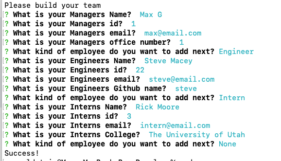
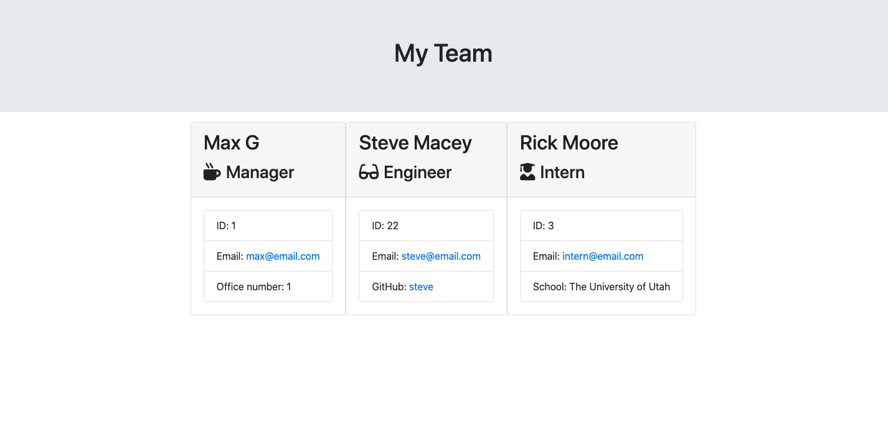

# Team Profile Generator
  
## License
  

## Description

The team profile generator is a command line application that takes user data and gernerates an html page with the user date. This application utilizes node.js, html. javascript tests and npm inquier and jest.

To use the application users will use the repo and download it onto there computer then do an npm i to install inquirer and jest. To utilize the application the user will then run the node app.js file and answer the promted questions.

While creating this application I used tests for the first time utilzed how they were written to write my classes and constructors. From there I created prompts for the user and used recursion so the question of adding an engineer, intern, or nothing always ran after the last question was answered.

Here is a link to a video demonstration: <a href ="https://drive.google.com/file/d/1TnzR_ecQs5VYendy_w_Do8BJkjUQya8f/view"> Video demo link</a>

And below are screen shots of the prompts and the generated HTML:

# Questions
If you have any questions about the repo, open an issue or contact me directly at magoldstein93@gmail.com . You can find more of my work on my GitHub maxgoldstein93 .
